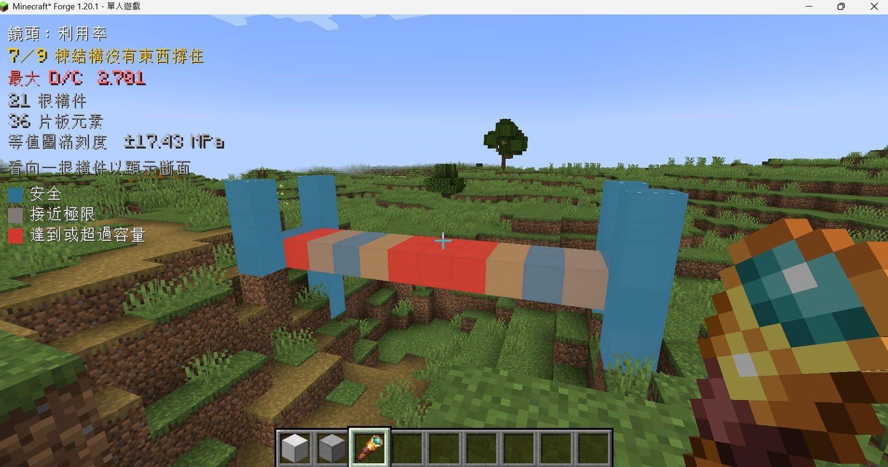
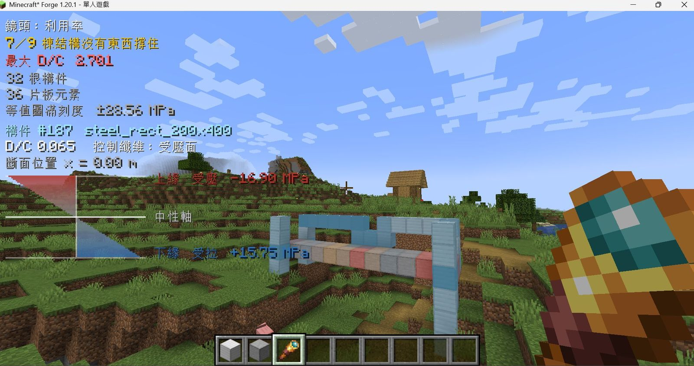

# Block Reality

[English](README.md) · **中文**

Minecraft 1.20.1 的結構分析模組。放置的方塊會被擷取為 6 自由度樑構件與 MITC4 板殼 facet，
交由遊戲程序之外的有限元素求解器計算，結果以方塊表面的應力等值圖，以及每根構件、每片板的
需求容量比（D/C）回到畫面上。



利用率鏡頭。角落的讀數就是這一次求解的結果：構件數、板 facet 數、最大 D/C，以及世界中有幾棟
結構未獲拘束、因而被判定為機構而不給應力。

## 需求

- Minecraft **1.20.1**
- Forge **47.x**（[下載](https://files.minecraftforge.net/net/minecraftforge/index.html)）

## 安裝

1. 下載
   [**`blockreality-0.2a.zip`**](https://github.com/rocky59487/block-reality/releases/download/v0.2a/blockreality-0.2a.zip)
   （2.4 MB）。之後的版本在
   [Releases 頁](https://github.com/rocky59487/block-reality/releases/latest)
2. 解壓縮後，Windows 執行 `install.bat`，Linux 執行 `./install.sh`
   （macOS：mod 可安裝可玩，但發行包尚無 macOS 版引擎——除非自行建置 `br-sidecar`，分析為關閉狀態）
3. 用平常的啟動器開遊戲

安裝器不帶參數執行時，會在原生啟動器、Prism、MultiMC、Modrinth、CurseForge 的慣用位置尋找
Minecraft 實例；找到多個會列出來讓你選。也可以自行指定遊戲目錄：

```
install.bat "D:\games\my-instance\.minecraft"
./install.sh ~/.minecraft
./install.sh --list      # 只列出找到的實例，不安裝
```

壓縮檔內容：

| | |
|---|---|
| `blockreality-*.jar` | Forge 模組，安裝至 `<實例>/mods/` |
| `br-sidecar` / `br-sidecar.exe` | 分析引擎，安裝至 `<實例>/` |
| `START-HERE.txt` / `讀我-中文.txt` | 說明文件，英文與中文 |
| `SHA256SUMS.txt` | 每個檔案的 SHA-256 |

FrameCore 已靜態連結進 `br-sidecar`，沒有另外要安裝的函式庫。`br-sidecar` 以獨立程序執行而非
由模組載入（D-013），因此 C++ 端的錯誤只影響一次分析，不影響伺服器與存檔。模組尋找引擎的順序
為設定檔、`-Dbr.sidecar`、`BR_SIDECAR`、遊戲目錄、`PATH`。引擎為選配，沒有它模組仍正常載入，
分析功能關閉並顯示狀態。

### 從原始碼執行

倉庫根目錄的 `run.bat`（Windows）或 `./run.sh`（Linux）會啟動開發用客戶端，只需要 `PATH` 上有
JDK 17，Minecraft 與 Forge 由 ForgeGradle 於首次執行時取得。

Minecraft 與 Forge 不可轉散布，因此任何可以交給別人的壓縮檔裡都不可能含有它們，也就不存在
解壓縮即可遊玩的完整包。

## 使用

創造分頁「Block Reality」提供全部結構方塊與應力眼鏡。方塊的 token 決定它成為哪種元素——
樑與板是不同的元素型別,不是不同顏色：

| 方塊 | token | 元素 | 尺寸 |
|---|---|---|---|
| 結構鋼 | `steel_rect_200x400` | 6 自由度樑 | 斷面 200 × 400 mm |
| 結構鋼 150x300 | `steel_rect_150x300` | 6 自由度樑 | 斷面 150 × 300 mm |
| 結構鋼 100x200 | `steel_rect_100x200` | 6 自由度樑 | 斷面 100 × 200 mm |
| 素混凝土樑 | `concrete_rect_400x600` | 6 自由度樑 | 400 × 600 mm,無筋——受拉 3 MPa 就裂,正該如此 |
| 木樑 | `timber_rect_140x240` | 6 自由度樑 | 140 × 240 mm 製材斷面 |
| 磚柱 | `brick_rect_230x350` | 6 自由度樑 | 230 × 350 mm 砌體柱 |
| 混凝土樓板 | `concrete_slab_200` | MITC4 板殼 facet | 厚 200 mm |
| 混凝土樓板 150 | `concrete_slab_150` | MITC4 板殼 facet | 厚 150 mm |
| 鋼板 20 | `steel_plate_20` | MITC4 板殼 facet | 厚 20 mm |

每個 token 在拿到方塊之前都先過閉合解 gate(`verify.py` C1/C1b/C15)。刻意**沒有**磚牆板：
板的篩選是彈性 von Mises,看不見脆性材料的拉壓不對稱——磚因此只以柱存在,樑篩選的五個
獨立比值(含受拉)能誠實處理不對稱。

**什麼叫接地**：一個結構方塊，其*正下方*是實心且非結構的方塊。除此之外沒有別的接地方式——
樑從側面頂著一面牆並不算被牆撐住，分析會正確地把結果判為機構。

第一個懸臂：蓋一面五格高的石牆，在牆頂放一格結構鋼，再往外接四格排成一直線伸進空中，拿起
應力眼鏡，蹲下右鍵最外側那一格施加 20 kN 測試荷載（同一個動作可以再把它移除）。看向該構件，
畫面角落就會顯示它的斷面讀數。



斷面讀數：構件編號與斷面 token、D/C、控制纖維與其沿構件的位置，以及沿斷面高度的應力剖面，
上下緣應力值與中性軸位置一併標示。

上緣受拉或受壓取決於結構形式而非構件本身——懸臂上凸，上緣受拉；兩端有支承的樑下垂，上緣受壓。
HUD 因此以文字標明拉壓，不要求從顏色反推。

對空氣右鍵可切換鏡頭：利用率、應力、材料。

| 指令 | |
|---|---|
| `/br status` | 引擎狀態、搜尋過的每一條路徑、傳輸方式、上一次的結果 |
| `/br members` | 每根構件的 D/C、控制纖維、控制斷面、峰值應力 |
| `/br section <id>` | 單一構件的完整應力剖面，純文字 |
| `/br load <fx> <fy> <fz>` | 對注視的方塊施加測試荷載（kN）——`/br load 30 0 0` 就是把剪力牆往側面推 |
| `/br unload` / `/br unload all` | 移除注視方塊的荷載／全部移除 |
| `/br loads` | 列出所有測試荷載 |
| `/br scan [半徑]` | 重讀你周圍的區塊，預設半徑 4——供指令或 WorldEdit 放置的方塊使用 |
| `/br resolve` | 強制重新分析 |
| `/br reset` | 引擎被停用後重新啟動（需 OP） |

更多案例——樓板、剪力牆、細長柱的挫屈、構件中段加載——見 [`QUICKSTART.md`](QUICKSTART.md)。

## 範圍

已實作：6 自由度樑構件、MITC4 板殼（含樓板與剪力牆）、含樑與板殼幾何勁度的線性挫屈、每構件
與每片板的 D/C、方塊表面的應力等值圖，以及模組與引擎之間的零拷貝共用記憶體傳輸（JSON 保留為
fallback 與除錯面）。wire 上的每一個力學數值都是引擎函式的回傳值,由引擎自己的閉合解 gate
把關——轉接層不算任何東西。設計層與工法層尚未開始。

未實作：板的 D/C 只是彈性表面篩選——橫向剪力有算出來也有回報，但不納入篩選；沒有逐片板的挫屈
檢核，也沒有板的極限強度。沒有 RC 複合斷面，斷面目錄裡是實心矩形與實心圓形，命名也照實寫。
沒有非線性後挫屈：挫屈倍數是線性起始點，是真實臨界載重的上界。

## 驗證

| | |
|---|---|
| 引擎 | `sidecar/verify.py` 219 項全過，每一項都對閉合解、不依賴求解器的不變量,或傳輸等價 oracle |
| Java | 184 項測試全過（純 Java 155、Forge 側 29），其中 28 項會實際啟動 `br-sidecar` 執行 FrameCore |
| 對閉合解 | 31 項非零參考，最差相對誤差 1.2e-14；10 項零參考，最差絕對殘差 1.5e-08。（前兩版在這裡引用的 1.6e-10,後來查明是舊 wire 的 10 位截斷,不是引擎） |
| 傳輸 | 數值以 raw little-endian double 走共用記憶體,從不文字化;JSON fallback 印 17 位有效數字。gate:三個代表案兩種傳輸逐位元相同 |
| 板元素收斂 | 固端方形板每邊 20 元素：跨中彎矩 0.57%，還原後的支承彎矩 2.7% |
| 剪力牆 | h/w ≥ 5 對梁理論：剪力流 1.4e-7、傾覆 ~1e-9；h/w = 3 是 2.7e-5 / 6.8e-7；方形牆是深樑，樑理論本身不適用（1e-3 至 2e-2 是參考模型的誤差） |
| 線性挫屈 | 單元素柱對課本值 1.6e-05；1/L² 關係 2.3e-10 |
| 跨平台決定性 | 8/8 逐位元相同，Linux 原生對 Windows 交叉編譯 |
| 效能 | 傳輸（同一個 86 構件模型兩種走法）：共用記憶體 4.5 ms、JSON 28.3 ms（省 84%）；199 構件、1200 自由度的完整往返（含挫屈）在充滿雜訊的參考筆電上約 0.1 s——且永不在 tick 執行緒上,這是「拿到結果的延遲」不是「從遊戲拿走的時間」 |

每一次求解的回覆都附帶全域平衡殘差，該值由幾何與密度重算，而非從組裝後的載重向量讀回。完整
紀錄見 [`evidence/VERIFICATION.md`](evidence/VERIFICATION.md)，由 `scripts/evidence.py` 產生。

## 文件

| 檔案 | |
|---|---|
| [`QUICKSTART.md`](QUICKSTART.md) | 安裝、自行建置、進遊戲後的操作 |
| [`docs/RELEASING.md`](docs/RELEASING.md) | 打包與發版流程 |
| [`docs/ENGINE_BOUNDARY.md`](docs/ENGINE_BOUNDARY.md) | Java 與力學引擎的介面契約 |
| [`docs/MEMBER_SEMANTICS.md`](docs/MEMBER_SEMANTICS.md) | 方塊如何成為構件 |
| [`docs/DECISIONS.md`](docs/DECISIONS.md) | 架構決策紀錄 |
| [`docs/GATES.md`](docs/GATES.md) | 驗收判準 |
| [`evidence/VERIFICATION.md`](evidence/VERIFICATION.md) | 驗證紀錄，自動產生 |
| [`docs/outreach/`](docs/outreach/OUTREACH.md) | 學術合作、社群發佈與資助申請的行動手冊 |
| [`CLAUDE.md`](CLAUDE.md) | 開發指引與不變式 |

## 授權

Block Reality 以 Apache License 2.0 授權，見 `LICENSE` 與 `NOTICE`。

力學後端 FrameCore 為本倉庫授權範圍之外的外部 source dependency，依其原專案的 MIT License
授權。其他第三方元件保留各自的授權與著作權聲明。
